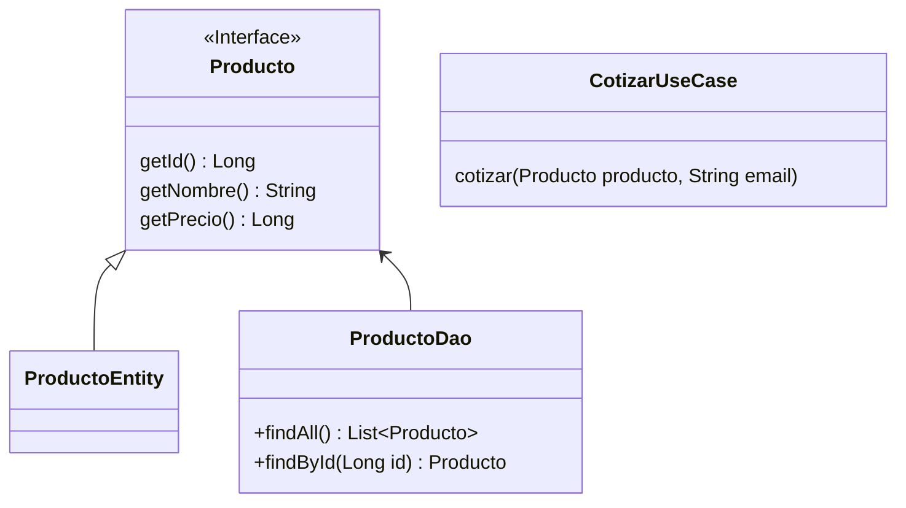

# Github

## Mermaid

```mermaid
classDiagram
    class Producto {
        <<Interface>>
        getId() Long 
        getNombre() String 
        getPrecio() Long 
    }
    Producto <|-- ProductoEntity     
    class ProductoEntity{
        
    }
    Producto <-- ProductoDao
    class ProductoDao {
        +findAll() List~Producto~
        +findById(Long id) Producto
    }
    class CotizarUseCase {
        cotizar(Producto producto, String email)
    }
```
