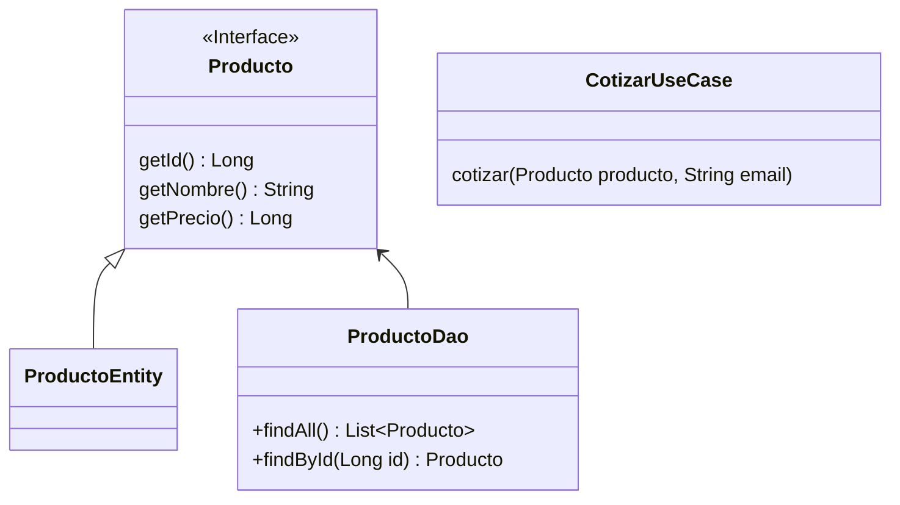
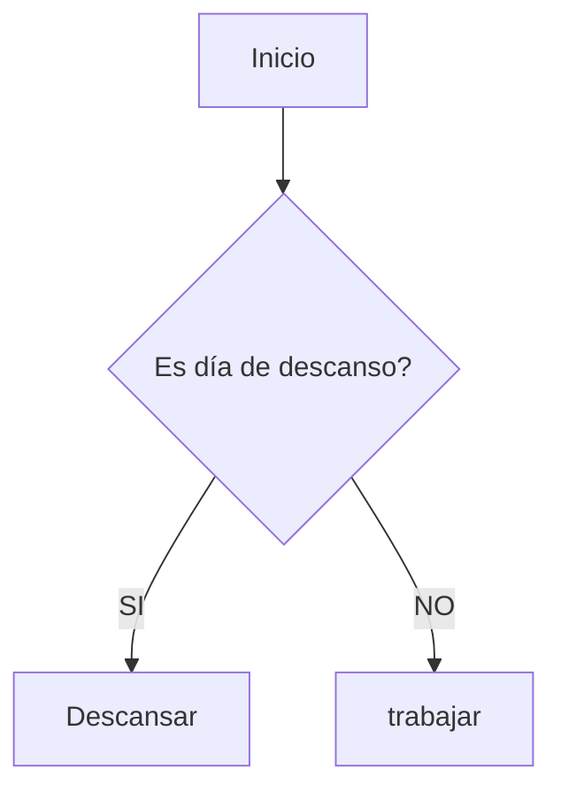
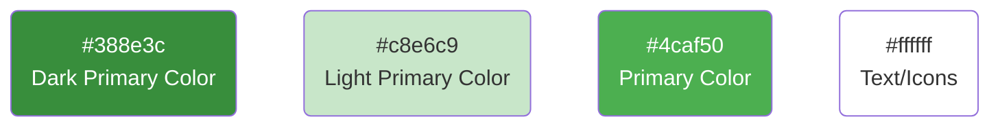
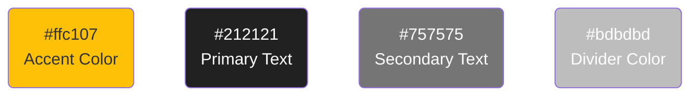

# Github

## Mermaid

### Class Diagram 

```mermaid
classDiagram
    class Producto {
        <<Interface>>
        getId() Long 
        getNombre() String 
        getPrecio() Long 
    }
    Producto <|-- ProductoEntity     
    class ProductoEntity{
        
    }
    Producto <-- ProductoDao
    class ProductoDao {
        +findAll() List~Producto~
        +findById(Long id) Producto
    }
    class CotizarUseCase {
        cotizar(Producto producto, String email)
    }
```

## Flowchart 

```mermaid
flowchart
    Inicio[Inicio] --> esDescanso{Es día de descanso?} 
    esDescanso --> |SI| descansar[Descansar]
    esDescanso --> |NO| trabajar[trabajar]
```

### Flowchart (other cases)

```mermaid
flowchart
    darkPrimaryColor(#388e3c<br />Dark Primary Color)
    style darkPrimaryColor fill:#388e3c,color:#fff

    lightPrimaryColor(#c8e6c9<br />Light Primary Color)
    style lightPrimaryColor fill: #c8e6c9 

    primaryColor(#4caf50<br />Primary Color)
    style primaryColor fill:#4caf50,color:#fff

    textIcons(#ffffff<br />Text/Icons) 
    style textIcons fill:#fff    
```

```mermaid
flowchart
    accentColor(#ffc107<br />Accent Color) 
    style accentColor fill: #ffc107

    primaryText(#212121<br />Primary Text) 
    style primaryText fill:#212121,color:#fff

    secondaryText(#757575<br />Secondary Text)
    style secondaryText fill:#757575,color:#fff

    dividerColor(#bdbdbd<br />Divider Color)
    style dividerColor fill:#bdbdbd,color:#fff
```
